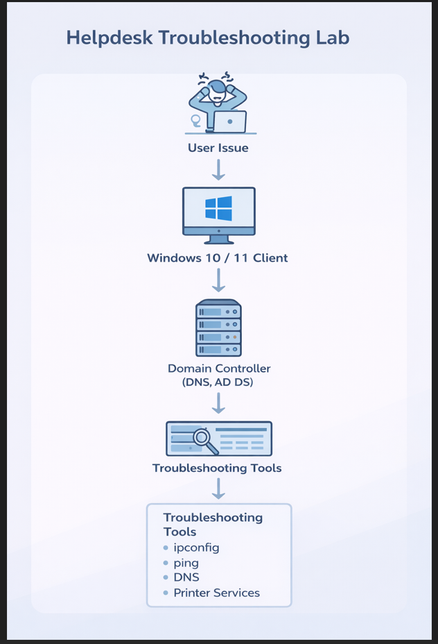

# Helpdesk Troubleshooting Lab

## Lab Overview

This lab simulates common IT helpdesk troubleshooting scenarios in a Windows enterprise environment using virtual machines.

The goal is to demonstrate practical troubleshooting methodology used by IT support professionals.

Environment built using:

- Windows Server 2022 (Domain Controller)
- Windows 11 Client
- Active Directory Domain
- VirtualBox

- ## Lab Architecture

---

## Ticket 1 – User Account Login Issue

Problem:
User unable to log in to their account.

Troubleshooting Steps:
- Opened Active Directory Users and Computers
- Located user account
- Checked account status and password settings
- Verified account was not locked or expired

Resolution:
Confirmed account configuration and reset credentials if necessary.

---

## Ticket 2 – No Internet Connectivity

Problem:
User reports no internet access.

Troubleshooting Steps:
- Checked network connection status
- Ran `ipconfig` to verify IP configuration
- Used `ping` to test connectivity
- Tested DNS resolution

Tools Used:
- ipconfig
- ping
- nslookup

Resolution:
Identified networking issue and restored connectivity.

---

## Ticket 3 – Printer Not Working

Problem:
User unable to print documents.

Troubleshooting Steps:
- Checked installed printers
- Opened Windows Services
- Located **Print Spooler service**
- Restarted the Print Spooler service

Resolution:
Restarting the service restored printer functionality.

---

## Skills Demonstrated

- Active Directory user management
- Windows troubleshooting methodology
- Network diagnostics
- Service management
- Helpdesk ticket workflow
