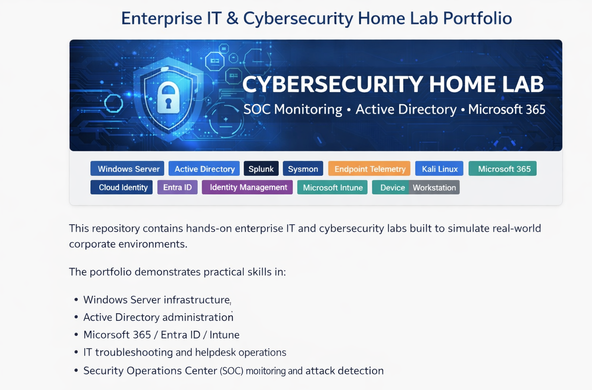
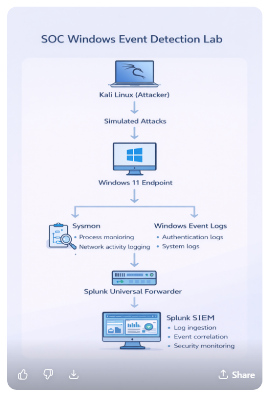

# Enterprise IT & Cybersecurity Home Lab Portfolio


This environment simulates a small enterprise IT infrastructure with security monitoring and attack detection.



This repository contains hands-on enterprise IT and cybersecurity labs built to simulate real-world corporate environments.

The portfolio demonstrates practical skills in:

• Windows Server infrastructure  
• Active Directory administration  
• Microsoft 365 / Entra ID / Intune  
• IT troubleshooting and helpdesk operations  
• Security Operations Center (SOC) monitoring and attack detection

## Enterprise Lab Architecture

Windows 11 Host Machine
│
└── VMware Workstation
│
├── DC01
│ ├── Windows Server 2022
│ ├── Active Directory
│ └── DNS
│
├── Windows 11 Client
│ ├── Domain Joined Endpoint
│ ├── Sysmon Installed
│ └── Splunk Universal Forwarder
│
└── Kali Linux
└── Attacker Machine (Attack Simulation)

Security monitoring flow:

```
Kali Linux (Attacker)
        │
        │  Simulated Attacks
        ▼
Windows 11 Endpoint
(Sysmon logs generated)
        │
        │  Forwarded via
        ▼
Splunk Universal Forwarder
        │
        ▼
Splunk SIEM
(Security Event Monitoring & Detection)
```

---


This repository contains hands-on enterprise IT and cybersecurity labs built to simulate real-world corporate environments.

The labs demonstrate practical skills in:

• Windows Server infrastructure  
• Active Directory administration  
• Microsoft 365 / Entra ID / Intune  
• IT troubleshooting and helpdesk scenarios  
• Security Operations Center (SOC) monitoring and attack detection

---

## Labs Included

### Active Directory Enterprise Lab
[View Lab](./ActiveDirectory-Lab)
Enterprise Windows infrastructure deployment.

Skills demonstrated:
- Active Directory administration
- Domain management
- Group Policy configuration
- Windows enterprise infrastructure

---

### SOC Active Directory Attack Detection Lab
[View Lab](./SOC-ActiveDirectory-Attack-Lab)
Detection of credential dumping attacks using Windows logs and SIEM.

Skills demonstrated:
- SOC monitoring
- Attack detection
- SIEM log analysis
- Endpoint telemetry

---

### SOC Windows Event Detection Lab
[View Lab](./SOC-Windows-Event-Detection-Lab)
Security monitoring and event investigation using Windows logs and Splunk SIEM.

Skills demonstrated:
- Security event investigation
- Authentication monitoring
- Suspicious activity detection
- SIEM analysis

---

### Microsoft 365 / Entra ID / Intune Lab
[View Lab](./Microsoft365-EntraID-Intune-Lab)
Cloud identity and device management using Microsoft 365.

Skills demonstrated:
- Entra ID user management
- Intune device management
- Cloud identity administration

---

### Helpdesk Troubleshooting Lab
[View Lab](./Helpdesk-Troubleshooting-Lab)
Common enterprise IT troubleshooting scenarios.

Skills demonstrated:
- Windows troubleshooting
- Network troubleshooting
- User support scenarios
- IT support workflow

- # Technologies Used

- Windows Server 2022
- Windows 11
- Active Directory
- DNS
- Sysmon
- Splunk SIEM
- Microsoft 365
- Entra ID
- Intune
- VMware / VirtualBox

---

# Author

Built as a hands-on portfolio to demonstrate practical enterprise IT, cloud administration, and cybersecurity skills.
