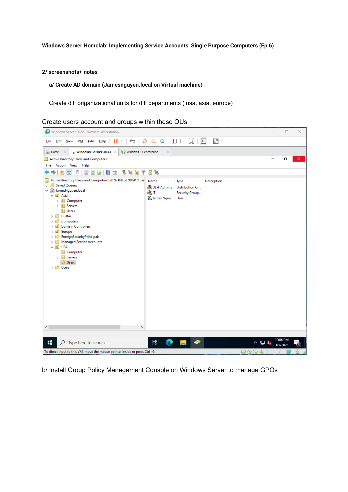
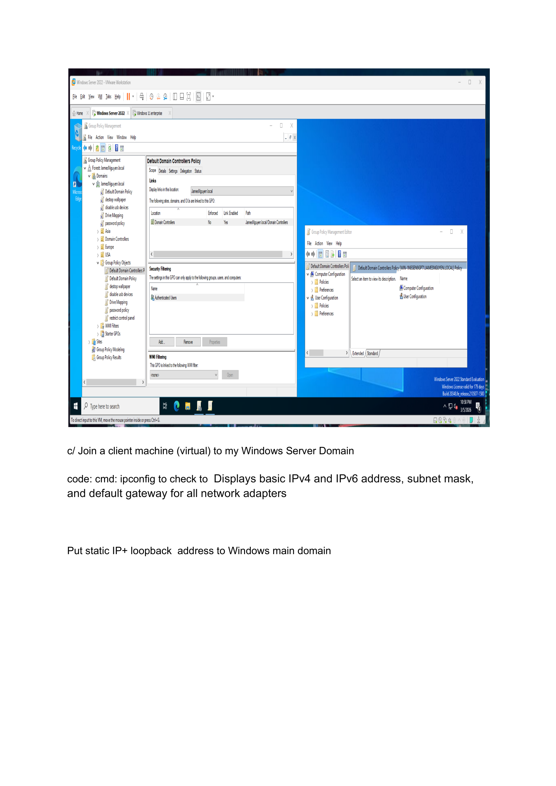
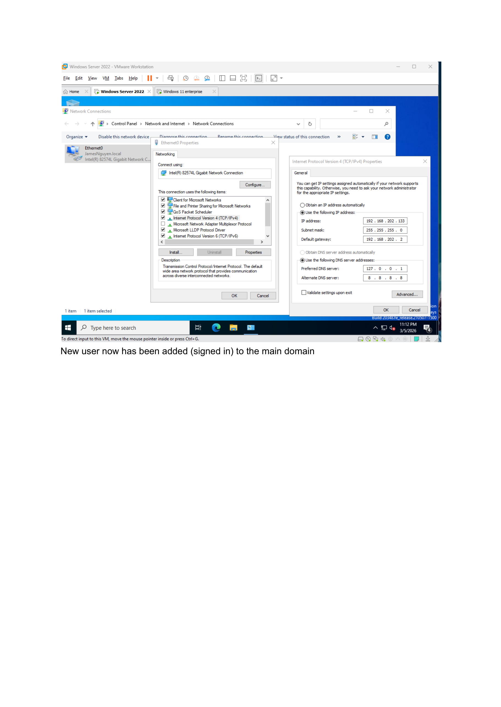
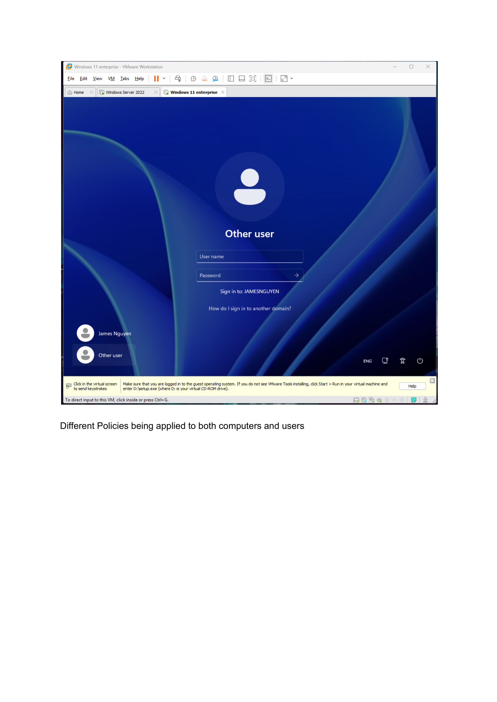
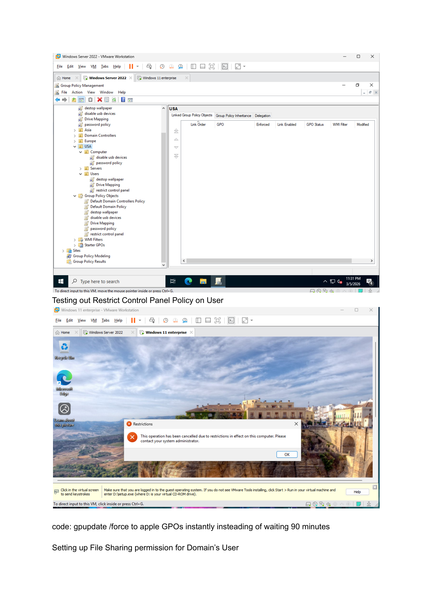
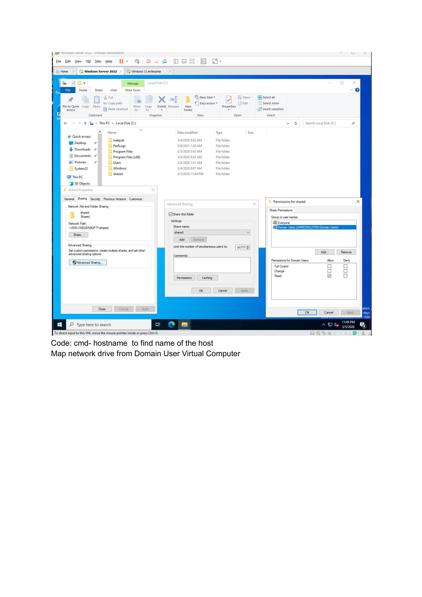
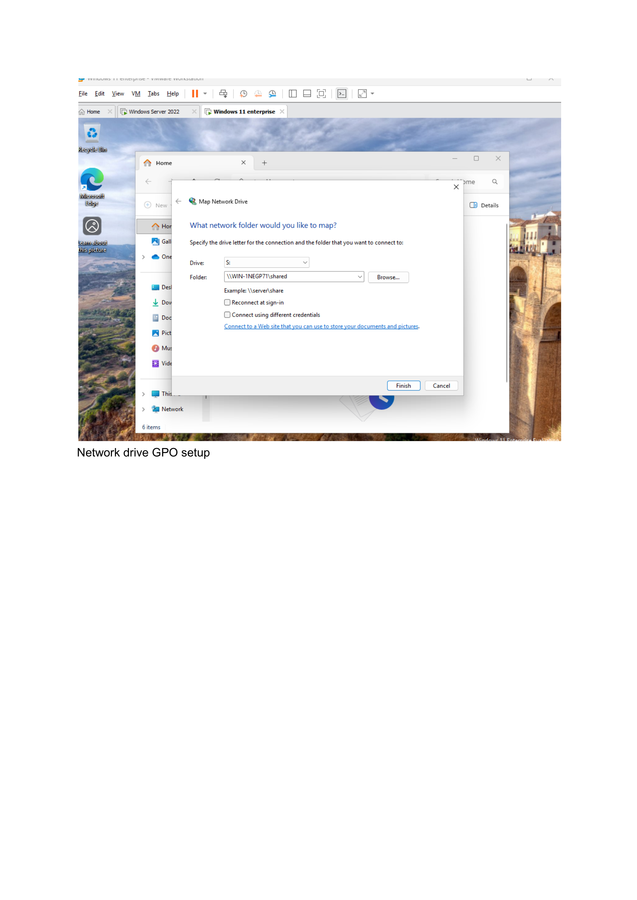
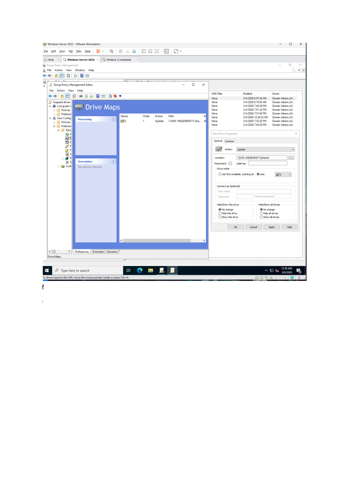

# EnterpriseIT-LabSuite

Hands-on enterprise IT lab demonstrating Windows Server 2022, Active Directory, Azure AD, Intune, networking troubleshooting, and security hardening.

This repository contains multiple enterprise-style home lab environments designed to simulate real-world IT infrastructure used in corporate environments.

## Labs Included

## Labs Included

- [Active Directory Enterprise Lab](ActiveDirectory-Lab)
- [Microsoft 365 / Entra ID / Intune Lab](Microsoft365-EntraID-Intune-Lab)
- [Helpdesk Troubleshooting Lab](Helpdesk-Troubleshooting-Lab)
  

# Active Directory Enterprise Lab

This lab demonstrates the deployment and configuration of a Windows Server Active Directory environment using VMware Workstation.

## Lab Architecture

Host Environment
- Host OS: Windows 11
- Hypervisor: VMware Workstation
- Network Type: NAT

Domain Controller
- Hostname: DC01
- Operating System: Windows Server 2022
- Domain: jamesnguyen.local
- Static IP: 192.168.202.133
- Subnet Mask: 255.255.255.0
- Default Gateway: 192.168.202.2
- DNS Server: 127.0.0.1

Client Machine
- Operating System: Windows 10
- Hostname: Comp01
- Domain Joined: jamesnguyen.local

## Implemented Features

- Active Directory Domain Services
- Organizational Units (USA, Asia, Europe)
- User and Security Group Management
- Domain Client Join
- Group Policy Management
- Control Panel Restriction Policy
- File Sharing & Permissions
- Network Drive Mapping via GPO

---

## Screenshots

Below are configuration steps captured during the lab setup:

---

## Commands Used

ipconfig  
ipconfig /all  
hostname  
gpupdate /force  

---

## Skills Demonstrated

- Windows Server Administration
- Active Directory Domain Services
- Group Policy Configuration
- Domain Networking
- Identity & Access Management
- File Services & Permissions
- Enterprise IT Troubleshooting

---

This project is part of a larger **Enterprise IT Home Lab Suite** demonstrating enterprise infrastructure skills across Windows Server, Microsoft 365, networking, and security environments.
